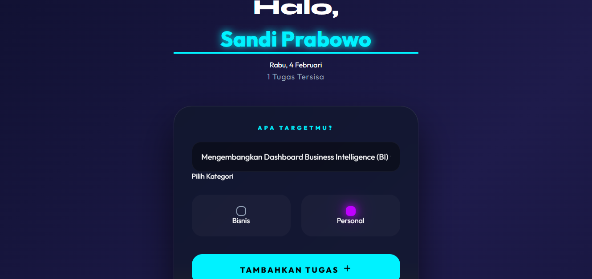

# 📝 Sandi's Modern To-Do List 2026

<<<<<<< HEAD
[](https://github.com/sovernbaezit/Sandi-Prabowo-TodoList/actions)


=======


>>>>>>> d115ca13ca3b37e3ec5fb63c32f54ba2e4546e08

Selamat datang di proyek **First-Step Frontend** saya! Aplikasi daftar tugas ini dirancang dengan antarmuka **Glassmorphism** yang modern dan futuristik, fokus pada kesederhanaan dan pengalaman pengguna yang lancar.

---

## 🚀 Fitur Unggulan
* **💾 Data Persistence**: Menggunakan **LocalStorage** sehingga tugasmu tetap aman dan tidak hilang meskipun halaman di-refresh.
* **👤 User Personalization**: Fitur input nama pengguna yang tersimpan otomatis untuk menyapa harimu.
* **📱 Responsive Design**: Tampilan yang tetap cantik di berbagai ukuran layar.
* **🎯 Task Categorization**: Pisahkan tugas harianmu ke dalam kategori 'Bisnis' atau 'Personal' dengan indikator warna yang menarik.

## 🛠️ Teknologi yang Digunakan
*  **HTML5**: Struktur semantik untuk aksesibilitas yang lebih baik.
*  **CSS3**: Menggunakan teknik *glass-effect*, animasi gelombang fluid, dan variabel warna neon.
*  **Vanilla JavaScript**: Logika murni untuk manipulasi DOM dan pengelolaan penyimpanan lokal.

---

## 🌐 Live Demo
Uji coba langsung pengalaman futuristik ini di sini:
<<<<<<< HEAD
> **🚀 [KLIK DI SINI UNTUK DEMO WEBSITE](https://sovernbaezit.github.io/Sandi-Prabowo-Todo-List/beginner/)**
=======
> **🚀 [KLIK DI SINI UNTUK DEMO WEBSITE](https://sovernbaezit.github.io/Sandi-Prabowo-TodoList/beginner/)**
>>>>>>> d115ca13ca3b37e3ec5fb63c32f54ba2e4546e08

---

## 📸 Dokumentasi Visual
Berikut adalah cuplikan antarmuka dari **ZenNeon Edition 2026**:

### 🔹 Tampilan Input & Header

*Antarmuka simetris dengan efek neon yang menyala pada nama pengguna.*

### 🔹 Kategori & Aktivitas Aktif

*Detail pemilihan kategori Business & Personal dengan indikator Glow.*

---

## 📂 Struktur Proyek
```text
<<<<<<< HEAD
MyFirst-Modern-TodoList/
=======
Sandi-Prabowo-TodoList/
>>>>>>> d115ca13ca3b37e3ec5fb63c32f54ba2e4546e08
├── beginner/
│   ├── index.html
│   ├── styles.css
│   └── script.js
├── picture-TodoList1.png
├── picture-TodoList2.png
└── README.md
